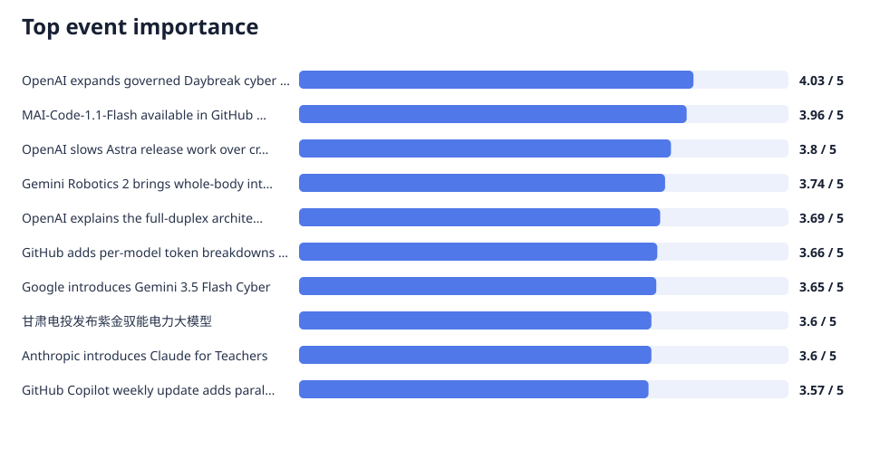
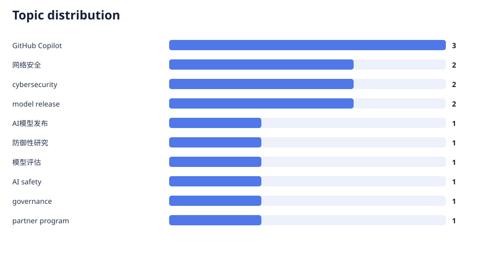
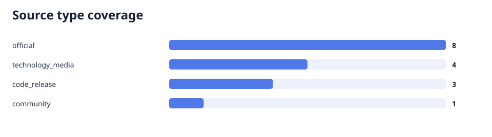

# AI 舆情分析日报 · 2026-08-12

生成时间：2026-08-12T07:13:00.425863+08:00  
数据覆盖：16 条来源、15 个事件、0 条隔离

## 执行摘要

本期AI情报围绕网络安全、模型能力与治理三大主线展开。OpenAI在扩展Daybreak受控访问并发布GPT-5.6-Cyber的同时，因内部评估无法排除Astra模型的关键网络安全能力而大幅扩大安全测试、放缓发布节奏，反映出前沿模型安全放行标准趋严；Google DeepMind亦以有限访问试点形式发布Gemini 3.5 Flash Cyber，凸显网络安全模型受控发布成为行业共识。模型侧呈现分化：编程与具身模型加速落地，GitHub Copilot推出降价73%的MAI-Code-1.1-Flash并新增按模型token成本明细，Google发布Gemini Robotics 2系列、Meta发布可本地运行的Muse Glimmer，OpenAI披露GPT-Live全双工语音架构。应用与生态侧，OpenAI承诺支持美国能源部Genesis Mission、Anthropic推出Claude for Teachers并投入千万加元于加拿大研究，国内甘肃电投发布电力大模型、腾讯云升级Agent Runtime。总体来看，前沿能力集中于少数头部厂商，而受控访问加治理约束正取代单纯发布成为网络安全类模型的通行策略。 本期覆盖 16 条信息，形成 15 个独立事件；语义字段由 deepseek:deepseek-chat 逐条抽取；所有结论均链接到来源 ID。有 0 条未通过质量门并被隔离，不进入趋势判断。

事实依据：`news_006.fact_01`、`news_006.fact_02`、`news_003.fact_01`、`news_003.fact_02`、`news_010.fact_03`、`news_001.fact_05`、`news_002.fact_02`、`news_005.fact_01`、`news_004.fact_01`、`news_008.fact_01`、`news_009.fact_02`、`news_015.fact_02`、`news_014.fact_03`、`news_012.fact_03`

## Top 事件

### 1. OpenAI expands governed Daybreak cyber access

背景：OpenAI正在扩大其Daybreak网络安全项目的受控访问范围，新增Blue与Red两个访问层级，并在治理框架下引入受信任的合作伙伴集成，这些集成配有范围限定的使用边界、日志记录、监控与人工监督。同时，OpenAI推出了面向受信任防御性研究人员的GPT-5.6-Cyber模型。内部高级网络安全评估显示，GPT-5.6-Cyber完成了95.0%的请求，而GPT-5.6 Sol仅完成1.5%、Daybreak Blue访问层级仅完成2.0%，表明该模型在网络攻防任务上的能力显著领先于同系基线模型，凸显其强大的潜在攻防用途。 影响判断：Daybreak扩展与GPT-5.6-Cyber的推出，叠加其95.0%请求完成率与通用模型1.5%的悬殊对比，使OpenAI同时面临机遇与治理压力。一方面，向防御性研究人员开放受控访问有助于加速网络漏洞发现与防护研究，符合其facts中体现的防御导向；另一方面，如此显著的攻防能力差距也抬高了滥用风险，这正是OpenAI将访问限定于受信任研究人员并配备日志、监控与人工监督的原因。从影响评分看，该事件在技术、应用与政策三个维度均为3.5、资本为2.0，说明其影响集中在能力展示与治理实践层面，而非直接的商业或资本信号。

来源：[news_006](https://openai.com/index/expanding-daybreak-as-the-cyber-defense-window-narrows/)、[news_007](https://openai.com/index/putting-frontier-cyber-models-in-more-trusted-hands/)
事实依据：`news_006.fact_01`、`news_006.fact_02`、`news_006.fact_03`、`news_006.fact_04`、`news_006.fact_05`
### 2. MAI-Code-1.1-Flash available in GitHub Copilot

背景：GitHub宣布Microsoft的MAI-Code-1.1-Flash正在GitHub Copilot中推出。这是一款小型编程模型，新增了原生视觉支持，并改善了编码质量、指令遵循、工具使用及性能。由于模型本身与服务器推理效率的提升，该模型的标价较上一代MAI-Code-1-Flash大幅降低了73%。这一底座模型能力的升级与降本，构成了本次产品发布的技术与商业背景。 影响判断：MAI-Code-1.1-Flash以降价73%的姿态进入GitHub Copilot，直接降低了企业级编程助手的模型调用成本，缩小了前沿大模型与低成本小模型之间的价格差，对开发者工具市场的竞争格局具有实际影响。其新增的原生视觉支持意味着Copilot可以更好地处理截图、界面元素等视觉输入，扩展了编码助手的应用边界。影响评分显示应用维度最高（4.0），技术维度为3.0，政策与资本维度仅为1.0和2.0，说明这是一项以产品化落地与普及为主、不涉安全治理的成熟应用型更新。

来源：[news_001](https://github.blog/changelog/2026-08-11-mai-code-1-1-flash-available-in-github-copilot/)
事实依据：`news_001.fact_02`、`news_001.fact_03`、`news_001.fact_04`、`news_001.fact_05`、`news_001.fact_01`
### 3. OpenAI slows Astra release work over critical cyber-capability concerns

背景：据Axios报道，OpenAI表示其内部评估无法排除即将推出的Astra模型存在关键网络安全能力，即模型可能具备较强的攻防代码应用潜力。为应对这一风险，OpenAI扩大了安全测试范围，并暂停了未达到更严格安全要求的内置活动。OpenAI技术团队成员也表示，在公司升级安全实践期间，测试进度有所放缓。这一系列的评估、扩测与暂停举措共同构成了Astra发布推迟的安全背景。 影响判断：OpenAI因无法排除Astra模型的关键网络安全能力而主动扩大安全测试、暂停不达标活动，意味着前沿模型的安全放行标准正在显著收紧，安全测试范围与严格程度已成为决定发布节奏的前置条件。这一事件本身也是AI安全治理的重要信号：模型能力评估不再是事后补充，而是直接制约产品上市的时间轴。影响评分中技术维度最高（4.0），应用与政策维度均为3.0，表明影响集中于模型评估方法论与安全治理实践层面。结合同期OpenAI在Daybreak与网络安全模型上的受控发布动作，可印证治理思维正深度嵌入前沿模型生命周期。

来源：[news_003](https://www.axios.com/2026/08/07/openai-astra-model-delay-cybersecurity-risks)
事实依据：`news_003.fact_01`、`news_003.fact_02`、`news_003.fact_03`、`news_003.fact_04`
### 4. Gemini Robotics 2 brings whole-body intelligence to robots

背景：Google DeepMind发布了Gemini Robotics 2、Gemini Robotics ER 2与Gemini Robotics On-Device 2三个模型，覆盖全身视觉-语言-动作控制、多步骤任务的具身推理以及高效的本地执行能力。DeepMind表示该系统可以协调多个机器人，并能够在数小时的训练数据下将端侧模型适配到新的机器人本体。这一多模型矩阵与快速适配能力构成了本次机器人AI发布的背景。 影响判断：Gemini Robotics 2系列将视觉-语言-动作能力扩展到全身控制与多机器人协调，并将具备高效本地执行的端侧模型纳入体系，意味着机器人AI正从单一任务走向全身协调与群体协作，同时通过数小时数据即可适配新本体大幅降低部署门槛。影响评分在技术与应用维度均为4.0，反映出对具身智能技术栈和应用落地的双重推动，而政策维度仅1.0、资本维度2.0，说明当前信号主要停留在技术能力与产品形态层面，尚未形成明确的监管或资本影响。

来源：[news_005](https://deepmind.google/blog/gemini-robotics-2-brings-whole-body-intelligence-to-robots/)
事实依据：`news_005.fact_01`、`news_005.fact_02`、`news_005.fact_03`、`news_005.fact_04`
### 5. OpenAI explains the full-duplex architecture behind GPT-Live

背景：OpenAI在官方说明中描述了GPT-Live的全双工对话语音架构。GPT-Live被定位为全双工语音模型，能够同时聆听与说话，且其音频路径中无需独立的turn detector。系统的设计将更深的推理或工具使用异步委托给前沿模型，而不会打断正在进行的对话，其生产架构由流式推理、专用媒体路径、异步委托与优化传输共同构成。这些架构细节构成了本次技术说明的背景。 影响判断：OpenAI公开GPT-Live全双工架构，关键创新在于无需turn detector即可实现同时听说的自然对话，并将深层推理与工具使用异步委托给前沿模型而不中断对话。这一架构若推广，将重塑语音AI的产品体验，让语音交互更接近人类对话，同时通过异步委托在不牺牲体验的前提下接入更强的模型能力。影响评分中技术与应用均为4.0，说明该架构对语音交互产品和推理协作架构都有实质推动，而政策与资本维度仅1.0和2.0，表明目前影响集中在技术与产品层面。

来源：[news_008](https://openai.com/index/continuous-voice-interaction-with-gpt-live/)
事实依据：`news_008.fact_01`、`news_008.fact_02`、`news_008.fact_03`、`news_008.fact_04`
## 技术、应用、政策、资本趋势

> 下列判断来自已通过质量门的 16 条样本及其四维影响评分，不等同于全市场统计。

- **技术趋势**：本样本中，前沿模型能力与架构呈现多线突破并伴随治理收紧。网络安全领域，OpenAI的GPT-5.6-Cyber在内部高级评估中完成95.0%请求、远超通用模型1.5%，显示专用网络安全模型能力的代际式跃升；Google DeepMind同步发布经微调用于漏洞发现、验证与修补的Gemini 3.5 Flash Cyber。与此同时，OpenAI因无法排除Astra模型的关键网络安全能力而扩大安全测试、放缓测试进度，说明模型评估已经成为能力释放前的关键门槛。语音与具身方向同样进展显著，GPT-Live以无需turn detector的全双工架构实现异步委托推理，Gemini Robotics 2系列覆盖全身VLA控制与多机器人协调。整体看，技术演进集中于能力跃升与受控释放的二元结构。需注意，本样本仅来自少量权威来源，跨源覆盖度多为1.0，结论宜视为方向性判断。（来源：[news_006](https://openai.com/index/expanding-daybreak-as-the-cyber-defense-window-narrows/)、[news_007](https://openai.com/index/putting-frontier-cyber-models-in-more-trusted-hands/)、[news_003](https://www.axios.com/2026/08/07/openai-astra-model-delay-cybersecurity-risks)、[news_010](https://deepmind.google/blog/introducing-gemini-3-5-flash-cyber/)、[news_005](https://deepmind.google/blog/gemini-robotics-2-brings-whole-body-intelligence-to-robots/)、[news_008](https://openai.com/index/continuous-voice-interaction-with-gpt-live/)；事实：`news_006.fact_03`、`news_006.fact_04`、`news_003.fact_01`、`news_003.fact_02`、`news_010.fact_02`、`news_005.fact_02`、`news_008.fact_04`）
- **应用趋势**：应用落地层面，开发者工具、教育与行业场景呈现密集的产品化推进。GitHub Copilot推出降价73%的MAI-Code-1.1-Flash编程模型，并新增按模型划分的token成本明细、并发会话与isolated-worktree实验命令，持续改进开发者工作流与成本透明度；该模型新增的原生视觉支持也扩展了编码助手的输入方式。行业侧，甘肃电投发布紫金驭能电力大模型，应用于光伏巡检、风光功率预测与电力交易辅助决策，AI无人机巡检将全域周期从三个月缩至一周内；Google Gemini Robotics 2强调端侧模型数小时数据即可适配新机器人本体。教育与科研端，Anthropic推出面向美国K-12教师的Claude for Teachers免费访问，OpenAI承诺为约2000名美国国家实验室研究人员提供Codex访问。综合看，样本中的应用信号集中于开发者工具、具身机器人和垂直行业，商业化与普惠路径并存，但各来源独立、跨源覆盖有限，趋势强度应审慎评估。（来源：[news_001](https://github.blog/changelog/2026-08-11-mai-code-1-1-flash-available-in-github-copilot/)、[news_002](https://github.blog/changelog/2026-08-11-per-model-token-breakdown-in-the-usage-report/)、[news_014](https://www.gs.chinanews.com.cn/news/2026/07-29/394937.shtml)、[news_005](https://deepmind.google/blog/gemini-robotics-2-brings-whole-body-intelligence-to-robots/)、[news_015](https://www.anthropic.com/news/claude-for-teachers)；事实：`news_001.fact_03`、`news_001.fact_05`、`news_002.fact_02`、`news_014.fact_03`、`news_014.fact_04`、`news_005.fact_04`、`news_015.fact_02`）
- **政策趋势**：政策与治理维度的核心信号是受控访问正成为网络安全类模型的通行策略，而安全评估日益前置于模型发布流程。OpenAI扩展Daybreak项目的受控访问并为防御性研究人员提供GPT-5.6-Cyber，配置范围限定、日志、监控与人工监督；Google DeepMind因双用途性质将Gemini 3.5 Flash Cyber通过CodeMender平台以有限试点形式提供给政府和可信伙伴，明确旨在给防御者更早访问并降低滥用。OpenAI同时因无法排除Astra的关键网络安全能力而扩大测试、暂停未达标活动，显示监管内嵌于模型生命周期。政府与企业的合作亦在深化，OpenAI承诺支持美国能源部Genesis Mission，为约2000名研究人员提供Codex、API与GPT-Rosalind定向访问。需注意，本样本中政策类证据多源自厂商自述或单一权威媒体，跨源验证不足，政策趋势判断宜保持审慎样本边界。（来源：[news_006](https://openai.com/index/expanding-daybreak-as-the-cyber-defense-window-narrows/)、[news_007](https://openai.com/index/putting-frontier-cyber-models-in-more-trusted-hands/)、[news_010](https://deepmind.google/blog/introducing-gemini-3-5-flash-cyber/)、[news_003](https://www.axios.com/2026/08/07/openai-astra-model-delay-cybersecurity-risks)、[news_009](https://openai.com/index/advancing-the-next-era-of-national-science/)；事实：`news_006.fact_01`、`news_006.fact_02`、`news_010.fact_03`、`news_010.fact_04`、`news_003.fact_03`、`news_003.fact_04`、`news_009.fact_02`、`news_009.fact_05`）
- **资本趋势**：资本维度在本样本中的直接信号相对有限且分散。OpenAI承诺支持美国能源部Genesis Mission，投入400万美元Codex访问额度、300万美元API支持，并对250万美元支出提供最高1000万美元的API使用额度，体现对其科研生态的间接资源投放；Anthropic承诺向加拿大科研机构投入1000万加元用于有益且负责的AI应用，并宣布与Amii、Mila和Vector Institute等机构合作，属面向研究与生态的定向投入。腾讯云披露混元Hy3一周调用量增长68倍，指向模型使用热度而非直接融资。整体来看，本样本中的资本信号多以科研资助、API额度或生态投入形式出现，而非股权融资或商业化交易，且多由厂商自述，资金来源与用途细节有限。因此，资本维度的趋势仅为较弱的观察信号，尚不足以支撑明确的资本流向判断。（来源：[news_009](https://openai.com/index/advancing-the-next-era-of-national-science/)、[news_016](https://www.anthropic.com/news/canadian-ai-research)、[news_012](https://developer.cloud.tencent.com/article/2710977)；事实：`news_009.fact_02`、`news_009.fact_03`、`news_009.fact_04`、`news_016.fact_01`、`news_016.fact_02`、`news_012.fact_05`）

> 上图是辅助性的主题词分布；四方向趋势结论以结构化影响评分和事件证据为准。

## 风险信号

- **OpenAI expands governed Daybreak cyber access**：GPT-5.6-Cyber虽被评估为低于Critical阈值，但达到High网络安全能力阈值，具备较高网络能力，需关注其被滥用于攻击性用途的双用途风险及对应治理措施。；合作伙伴必须对模型结果进行人工审查后方可行动，且需满足身份验证、日志与监控等保障要求，这为伙伴引入额外的合规与运营成本，可能影响部署速度与ROI。（来源：[news_006](https://openai.com/index/expanding-daybreak-as-the-cyber-defense-window-narrows/)、[news_007](https://openai.com/index/putting-frontier-cyber-models-in-more-trusted-hands/)；事实：`news_006.fact_06`、`news_006.fact_07`、`news_007.fact_02`、`news_007.fact_03`）
- **OpenAI slows Astra release work over critical cyber-capability concerns**：Astra模型因内部评估无法排除关键网络安全能力而暂停部分活动并扩大测试，可能导致产品发布进一步延迟（事实基于fact_01、fact_02）。；模型具备关键网络安全能力可能引发监管关注与合规审查，增加发布前的政策不确定性（事实基于fact_01）。（来源：[news_003](https://www.axios.com/2026/08/07/openai-astra-model-delay-cybersecurity-risks)；事实：`news_003.fact_01`、`news_003.fact_02`）
- **Google introduces Gemini 3.5 Flash Cyber**：该技术的双重用途性质意味着相关能力在更广泛发布后可能带来滥用风险，因此需持续关注其受控试点之外的扩散路径。（来源：[news_010](https://deepmind.google/blog/introducing-gemini-3-5-flash-cyber/)；事实：`news_010.fact_04`、`news_010.fact_02`）

## 机会信号

- **OpenAI expands governed Daybreak cyber access**：GPT-5.6-Cyber在高级网络安全评估中完成率95.0%，远超GPT-5.6 Sol（1.5%）和Daybreak Blue（2.0%），表明面向防御性研究人员存在显著的技术能力机会，可用于网络安全防御研究场景。；Daybreak Cyber Partner Program 的扩大为网络安全企业提供了将前沿网络模型集成进受治理产品的合作机会，相关伙伴可通过身份验证、日志监控与人工监督等机制在受控防御工作流中部署模型。（来源：[news_006](https://openai.com/index/expanding-daybreak-as-the-cyber-defense-window-narrows/)、[news_007](https://openai.com/index/putting-frontier-cyber-models-in-more-trusted-hands/)；事实：`news_006.fact_03`、`news_006.fact_04`、`news_006.fact_05`、`news_007.fact_01`、`news_007.fact_02`、`news_007.fact_03`）
- **MAI-Code-1.1-Flash available in GitHub Copilot**：MAI-Code-1.1-Flash 通过效率提升大幅降价 73%，并新增原生视觉支持，可能吸引更多开发者在 GitHub Copilot 中使用该模型，扩大代码模型采用面。（来源：[news_001](https://github.blog/changelog/2026-08-11-mai-code-1-1-flash-available-in-github-copilot/)；事实：`news_001.fact_03`、`news_001.fact_05`、`news_001.fact_01`）
- **OpenAI slows Astra release work over critical cyber-capability concerns**：OpenAI升级安全实践并扩大测试，可能建立更稳健的安全评估基准，为AI安全生态提供参考（事实基于fact_02、fact_03、fact_04）。（来源：[news_003](https://www.axios.com/2026/08/07/openai-astra-model-delay-cybersecurity-risks)；事实：`news_003.fact_02`、`news_003.fact_03`、`news_003.fact_04`）
- **Gemini Robotics 2 brings whole-body intelligence to robots**：Gemini Robotics 2 提供数小时数据即可适配新机器人本体的能力（fact_04），以及多机器人协调能力（fact_03），对机器人厂商与具身智能应用开发者构成显著的低摩擦部署机会。（来源：[news_005](https://deepmind.google/blog/gemini-robotics-2-brings-whole-body-intelligence-to-robots/)；事实：`news_005.fact_03`、`news_005.fact_04`）
- **OpenAI explains the full-duplex architecture behind GPT-Live**：GPT-Live通过去除独立turn detector并采用异步委托前沿模型的设计，可能显著降低实时语音交互延迟，为语音助手、客服及实时翻译等应用带来新的产品机会。（来源：[news_008](https://openai.com/index/continuous-voice-interaction-with-gpt-live/)；事实：`news_008.fact_01`、`news_008.fact_02`、`news_008.fact_03`）
- **GitHub adds per-model token breakdowns to Copilot usage reports**：基于增加缓存读取/写入 token 与 AI 积分明细的能力，企业管理员可更精细地核算各模型的使用成本，为优化模型调用策略和预算分配提供依据。（来源：[news_002](https://github.blog/changelog/2026-08-11-per-model-token-breakdown-in-the-usage-report/)；事实：`news_002.fact_02`、`news_002.fact_03`）

## 来源覆盖

- [news_001] [MAI-Code-1.1-Flash available in GitHub Copilot](https://github.blog/changelog/2026-08-11-mai-code-1-1-flash-available-in-github-copilot/) — GitHub Changelog，2026-08-11T00:00:00+00:00
- [news_002] [GitHub adds per-model token breakdowns to Copilot usage reports](https://github.blog/changelog/2026-08-11-per-model-token-breakdown-in-the-usage-report/) — GitHub Changelog，2026-08-11T00:00:00+00:00
- [news_003] [OpenAI slows Astra release work over critical cyber-capability concerns](https://www.axios.com/2026/08/07/openai-astra-model-delay-cybersecurity-risks) — Axios，2026-08-07T16:30:28+00:00
- [news_004] [Meta releases Muse Glimmer and outlines a broader open-model strategy](https://apnews.com/article/df8a4e7d7825470d09e8090367457c2c) — Associated Press，2026-08-10T15:41:46+00:00
- [news_005] [Gemini Robotics 2 brings whole-body intelligence to robots](https://deepmind.google/blog/gemini-robotics-2-brings-whole-body-intelligence-to-robots/) — Google DeepMind，2026-07-30T00:00:00+00:00
- [news_006] [OpenAI expands Daybreak and introduces GPT-5.6-Cyber](https://openai.com/index/expanding-daybreak-as-the-cyber-defense-window-narrows/) — OpenAI，2026-08-10T00:00:00+00:00
- [news_007] [OpenAI expands the Daybreak Cyber Partner Program](https://openai.com/index/putting-frontier-cyber-models-in-more-trusted-hands/) — OpenAI，2026-08-10T00:00:00+00:00
- [news_008] [OpenAI explains the full-duplex architecture behind GPT-Live](https://openai.com/index/continuous-voice-interaction-with-gpt-live/) — OpenAI，2026-08-03T00:00:00+00:00
- [news_009] [OpenAI commits AI access and funding to the US Genesis Mission](https://openai.com/index/advancing-the-next-era-of-national-science/) — OpenAI，2026-07-22T00:00:00+00:00
- [news_010] [Google introduces Gemini 3.5 Flash Cyber](https://deepmind.google/blog/introducing-gemini-3-5-flash-cyber/) — Google DeepMind，2026-07-21T00:00:00+00:00
- [news_011] [GitHub Copilot weekly update adds parallel sessions and isolated worktrees](https://github.blog/changelog/2026-08-07-github-copilot-weekly-releases-august-3/) — GitHub Changelog，2026-08-07T00:00:00+00:00
- [news_012] [腾讯云7月集中升级AI存储、Agent Runtime与开发者工具](https://developer.cloud.tencent.com/article/2710977) — 腾讯云开发者社区，2026-07-17T11:43:14+08:00
- [news_013] [2026数博会将聚焦词元并设置人工智能大模型市集](https://www.news.cn/tech/20260729/d3b63475359e442da8c86de658e272be/c.html) — 新华网（科技日报），2026-07-29T08:52:51+08:00
- [news_014] [甘肃电投发布紫金驭能电力大模型](https://www.gs.chinanews.com.cn/news/2026/07-29/394937.shtml) — 中新网甘肃，2026-07-29T16:07:00+08:00
- [news_015] [Anthropic introduces Claude for Teachers](https://www.anthropic.com/news/claude-for-teachers) — Anthropic，2026-07-14T00:00:00+00:00
- [news_016] [Anthropic commits 10 million Canadian dollars to AI research](https://www.anthropic.com/news/canadian-ai-research) — Anthropic，2026-07-14T00:00:00+00:00

## 方法与限制

- 抽取阶段采用 `batch_size=1`，用更多请求换取证据逐字校验、精确重试、单条检查点和失败隔离。
- 证据片段必须逐字存在于规范化来源内容中，否则重试并最终隔离。
- 对事件聚类后再排名；同一事件的多篇内容不会作为独立 Top 项重复计数。
- 重要度采用 `importance-v1` 确定性公式；图表只读取校验后的结构化字段。
- 报告分析 Agent 只读取已验证事件摘要和结构化评分，不读取整批原始文章；每个分析段均保留事实 ID。
